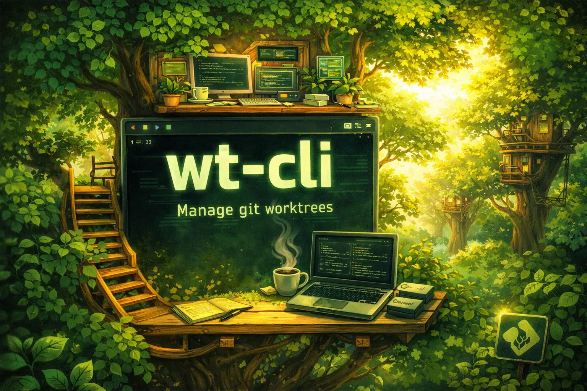

<div align="center">
  

  <br>

  <p>A CLI for managing git worktree-based development workflows.<br>
  Clone once as a bare repo, then spin up isolated worktrees per branch with shared config files, symlinks, and template variables.</p>

  <p>
    <a href="https://github.com/bkildow/wt-cli/releases/latest"></a>
    <a href="https://github.com/bkildow/wt-cli/blob/main/LICENSE"></a>
    <a href="https://github.com/bkildow/wt-cli"></a>
  </p>
</div>

---

## Features

- **Bare-repo workflow** — no `.git` at project root; all worktrees live under `worktrees/`
- **Shared files** — copy per-worktree configs or symlink heavy directories (node_modules, vendor) once
- **Template variables** — `${PROJECT_ROOT}`, `${WORKTREE_ID}`, `${BRANCH_NAME}`, etc. substituted in `.template` files
- **Interactive by default** — branch/worktree pickers when arguments are omitted
- **Setup/teardown hooks** — run commands automatically when creating or removing worktrees
- **Claude Code integration** — automatic worktree creation/removal via Claude Code hooks
- **Editor integration** — open worktrees in your preferred editor ($EDITOR, config, or auto-detect)
- **Shell completions** — tab-complete worktree names in bash, zsh, and fish
- **Dry-run support** — preview every destructive operation with `--dry-run`

## Requirements

- **Go 1.25+** (for building from source)
- **Git 2.40+** (for relative worktree paths via `--relative-paths`)

## Install

```bash
go install github.com/bkildow/wt-cli/cmd/wt@latest
```

Or build from source:

```bash
git clone https://github.com/bkildow/wt-cli.git
cd wt-cli
go build -o wt ./cmd/wt
# move wt to somewhere in your $PATH
```

## Quick Start

```bash
# Clone a repo into a bare worktree project
wt clone git@github.com:org/repo.git
cd repo

# Create a worktree for a feature branch
wt add feature/auth

# Navigate to it (see Shell Integration below for cd support)
cd "$(wt cd feature/auth)"

# See all worktrees
wt list

# When done, clean up merged branches
wt prune
```

## Commands

| Command | Description |
|---------|-------------|
| `wt clone <url> [name]` | Clone a repo as a bare worktree project |
| `wt add [branch]` | Create a new worktree for a branch |
| `wt list` | List all worktrees |
| `wt remove [name]` | Remove a worktree and its branch |
| `wt cd [name]` | Print worktree path for shell navigation |
| `wt root` | Print project root path for shell navigation |
| `wt apply [name]` | Apply shared files to a worktree |
| `wt open [name]` | Open a worktree in an IDE |
| `wt status` | Show status of all worktrees |
| `wt sync` | Fetch and pull all worktrees |
| `wt prune` | Remove worktrees with fully merged branches |
| `wt config init` | Generate annotated `.worktree.yml` with documentation |
| `wt claude init` | Configure Claude Code hooks for automatic worktree management |
| `wt agents` | Print AI agent workflow instructions |
| `wt shell-init <shell>` | Print shell startup config (wrapper + completions) |
| `wt completion <shell>` | Generate shell completion script |

### wt clone

```bash
wt clone <url> [name]        # Clone repo as bare worktree project
wt clone <url> --dry-run     # Preview without executing
```

Clones as a bare repo and writes `.worktree.yml`. Optionally prompts to create an initial worktree.

### wt config init

```bash
wt config init               # Generate annotated .worktree.yml (backs up existing)
wt config init --update      # Merge existing values into annotated template
```

Generates a `.worktree.yml` with documentation comments for every field. If a config already exists, it is backed up to `.worktree.yml.bak` first. Use `--update` to preserve your existing values while adding documentation comments.

### wt add

```bash
wt add feature/auth          # Create worktree for branch
wt add                       # Interactive branch picker
wt add feature/auth --skip-setup  # Create worktree without running setup hooks
```

Detects whether the branch exists remotely or creates a new local branch. Applies shared files and runs setup hooks. If setup hooks fail, the worktree is still created and you are CDed into it.

### wt remove

```bash
wt remove feature/auth       # Remove worktree and branch
wt remove --force            # Skip uncommitted changes check
wt remove feature/auth --skip-teardown  # Remove without running teardown hooks
```

Runs teardown hooks before removing the worktree directory.

### wt cd

```bash
cd "$(wt cd feature/auth)"   # Navigate to worktree
wt cd                        # Interactive picker
```

Prints the absolute path to stdout. When run without a shell wrapper, `wt cd` prints a hint about setting one up. See [Shell Integration](#shell-integration) for details.

### wt root

```bash
wt root                      # Navigate to project root (with shell wrapper)
cd "$(wt root)"              # Navigate without shell wrapper
```

Prints the absolute path to the project root (the directory containing `.worktree.yml`). With the shell wrapper, `wt root` changes your directory directly.

### wt apply

```bash
wt apply feature/auth        # Apply shared files to one worktree
wt apply --all               # Apply to all worktrees
```

Copies files from `shared/copy/` (with template substitution) and creates symlinks from `shared/symlink/`. Shows each file copied and symlink created, with a summary count.

### wt open

```bash
wt open feature/auth         # Open in editor
wt open                      # Interactive picker
```

Editor resolution order: `editor` field in `.worktree.yml` > `$EDITOR` env var > auto-detect (Cursor, VS Code, Zed).

### wt status

```bash
wt status
```

Shows branch, path, commit hash, dirty/clean status, and last commit age for all worktrees.

### wt sync

```bash
wt sync                      # Fetch + pull all clean worktrees
wt sync --rebase             # Use rebase instead of merge
```

Skips dirty worktrees. Shows summary of updated/skipped/failed counts.

### wt prune

```bash
wt prune                     # Remove worktrees with merged branches
wt prune --force             # Skip confirmation
```

Compares branches against the default branch (main/master).

### wt agents

```bash
wt agents                    # Print AI workflow guide to stdout
wt agents > AGENTS.md        # Save as a file in your project
```

Outputs structured workflow instructions for AI coding assistants to understand how to use `wt` in non-interactive mode.

### wt claude init

```bash
wt claude init               # Configure Claude Code hooks
wt claude init --binary /path/to/wt  # Use a specific wt binary path
```

Sets up [Claude Code hooks](https://docs.anthropic.com/en/docs/claude-code/hooks) so that Claude Code agents can create and remove worktrees automatically. Writes hook configuration to `shared/symlink/.claude/settings.local.json` and applies it to all existing worktrees via symlink.

This enables two hooks:
- **WorktreeCreate** — when Claude Code spawns a subagent with `--worktree`, `wt` creates the worktree, applies shared files, and runs setup hooks
- **WorktreeRemove** — when the subagent finishes, `wt` runs teardown hooks and cleans up the worktree and branch

Run `wt claude init` once per project. The hooks propagate to all worktrees automatically.

### wt completion

```bash
wt completion bash > /etc/bash_completion.d/wt
wt completion zsh > "${fpath[1]}/_wt"
wt completion fish > ~/.config/fish/completions/wt.fish
```

## How It Works

`wt` organizes a project like this:

```
project/
├── .bare/                   # Bare git repository (no working tree)
├── .worktree.yml            # Project configuration
├── shared/
│   ├── copy/                # Files copied into each worktree
│   │   └── .env.example     # Supports ${TEMPLATE_VARS}
│   └── symlink/             # Shared resources symlinked from worktrees
│       ├── .claude/         # Claude Code hooks (via wt claude init)
│       ├── node_modules/
│       └── vendor/
└── worktrees/
    ├── main/                # Each branch gets its own directory
    ├── feature-auth/
    └── feature-ui/
```

**Why a bare repo?** Standard `git worktree` puts the primary checkout at the repo root, mixing repo files with worktree management. A bare repo at `.bare/` keeps the root clean — it only holds configuration and shared resources.

**Copy vs Symlink:** Files in `shared/copy/` are duplicated into each worktree (useful for `.env` files that vary per branch). Files in `shared/symlink/` are symlinked (useful for large directories like `node_modules` you only want to install once).

## Configuration

### .worktree.yml

```yaml
version: 1
git_dir: .bare
main_branch: main
editor: cursor
setup:
  - "cp .env.example .env"
parallel_setup:
  - "npm install"
  - "bundle install"
teardown:
  - "docker compose down"
parallel_teardown:
  - "make clean"
  - "rm -rf tmp/"
```

| Field | Description | Default |
|-------|-------------|---------|
| `version` | Config version | `1` |
| `git_dir` | Path to bare repository | `.bare` |
| `main_branch` | Primary branch (branch ref protected from deletion, used as base for new branches) | `main` |
| `editor` | Preferred editor binary name | (auto-detect) |
| `setup` | Commands to run sequentially after creating a worktree | `[]` |
| `parallel_setup` | Commands to run concurrently after serial setup hooks | `[]` |
| `teardown` | Commands to run sequentially before removing a worktree | `[]` |
| `parallel_teardown` | Commands to run concurrently after serial teardown hooks | `[]` |

### Setup & Teardown Hooks

Hooks run in the worktree directory via `sh -c`. Serial hooks (`setup`/`teardown`) run sequentially; a failing hook is logged but does not prevent subsequent hooks from running.

- **Setup hooks** run after worktree creation and shared file application. If any hook fails, `wt add` reports the error (the worktree is still created).
- **Teardown hooks** run before worktree removal. Hook failures are logged as warnings and do not prevent removal.
- Both respect `--dry-run` (prints what would run without executing).

### Parallel Hooks

Use `parallel_setup` and `parallel_teardown` for independent commands that can run concurrently (e.g., installing packages for different language ecosystems). Execution order:

1. Serial hooks run first (`setup` / `teardown`)
2. Parallel hooks run after serial hooks complete (`parallel_setup` / `parallel_teardown`)

All parallel commands start simultaneously and run to completion — a failing command does not cancel the others. Each command's output is prefixed with `[command]` to distinguish interleaved output. `--skip-setup` and `--skip-teardown` skip both serial and parallel hooks.

### Template Variables

Files in `shared/copy/` ending in `.template` get variable substitution, with the `.template` suffix stripped from the output filename. All other files are copied as-is.

Example: `shared/copy/.env.template` → `worktrees/feature-auth/.env`

| Variable | Derivation | Example (branch: `feature/Auth`) |
|----------|------------|----------------------------------|
| `${PROJECT_ROOT}` | Absolute project root path | `/path/to/project` |
| `${WORKTREE_ID}` | Branch lowercased, `/` → `-` | `feature-auth` |
| `${WORKTREE_PATH}` | Absolute worktree path | `/path/to/worktrees/feature/Auth` |
| `${BRANCH_NAME}` | Raw branch name | `feature/Auth` |

## Shell Integration

Add one line to your shell config to enable directory navigation (`wt cd`) and tab completions:

**Bash** (`~/.bashrc`):

```bash
eval "$(wt shell-init bash)"
```

**Zsh** (`~/.zshrc`):

```bash
eval "$(wt shell-init zsh)"
```

**Fish** (`~/.config/fish/config.fish`):

```fish
wt shell-init fish | source
```

This sets up a `wt` wrapper function so that `wt cd` and `wt root` change your directory, and registers tab completions for all commands and worktree names.

### Manual Setup

If you prefer to configure the wrapper and completions separately, see `wt shell-init <shell>` for the wrapper function source and `wt completion <shell>` for standalone completion scripts.

## License

MIT
